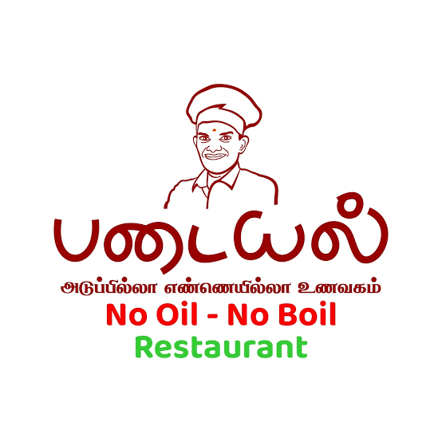

# Padayal Cafe

<p align="center">
  
</p>

<p align="center">
  <strong>Padayal • No Oil • No Boil • Restaurant</strong>
</p>

A modern restaurant and dining experience built with React, TypeScript, and Tailwind CSS for Padayal, a South Indian natural-food concept focused on traditional ingredients, no refined oil, and wholesome plant-based meals.

## Overview

Padayal is a mobile-first restaurant web application designed to showcase the brand, menu, dining experience, reservations, and order flow for a natural-food restaurant in Coimbatore. The app includes a catalog of menu items, promotional offers, order tracking, table booking, and a polished customer-facing experience built around an organic, earthy visual style.

The project is a Vite + React application and uses local state persistence for cart and order data, with fallback behavior for Supabase-backed features when database configuration is not present.

## Features

- Interactive menu browsing with category filtering and item details
- Customization flow for add-ons, portion size, and price updates
- Cart and checkout experience with promo code validation and order breakdown
- Order tracking and status updates for dine-in, takeaway, and delivery
- Table reservation flow with booking details and confirmation reference
- Mobile-first UI for restaurant browsing on phones and tablets
- Brand storytelling for the Padayal philosophy, ingredients, and heritage
- Admin dashboard patterns for menu, reservations, contacts, and gallery management via Supabase

## Tech Stack

- React 18
- TypeScript
- Vite
- Tailwind CSS
- React Router DOM
- Supabase JS client
- Lucide React icons

## Project Structure

```text
Padayal-Cafe/
├── public/
│   ├── images/
│   ├── icons/
│   ├── logo.png
│   ├── manifest.json
│   └── favicon.svg
├── src/
│   ├── components/
│   ├── config/
│   ├── context/
│   ├── hooks/
│   ├── lib/
│   ├── pages/
│   ├── types/
│   ├── utils/
│   ├── App.tsx
│   ├── index.css
│   └── main.tsx
├── index.html
├── package.json
├── tailwind.config.js
├── vite.config.ts
├── tsconfig.json
├── tsconfig.app.json
├── tsconfig.node.json
├── eslint.config.js
├── postcss.config.js
├── .gitignore
└── README.md
```

## Prerequisites

- Node.js 18+
- npm 9+

## Installation

```bash
git clone https://github.com/navneethvaradharaj11-dev/Padayal-Cafe.git
cd Padayal-Cafe
npm install
```

## Environment Variables

The app uses Supabase through `src/lib/supabase.ts` and falls back to placeholder values when environment variables are not configured.

Create a `.env` file in the project root if you want to enable live Supabase-backed features:

```bash
VITE_SUPABASE_URL=https://your-project.supabase.co
VITE_SUPABASE_ANON_KEY=your-anon-key
```

Without these values, the app still runs in a local/demo state with graceful fallbacks.

## Running the App

### Development

```bash
npm run dev
```

The local development server typically runs at:

```text
http://localhost:5173
```

### Production Build

```bash
npm run build
```

### Preview Production Build

```bash
npm run preview
```

### Type Check

```bash
npm run typecheck
```

### Lint

```bash
npm run lint
```

## Deployment

The repository includes a Vercel deployment badge and the project is intended to be deployable to Vercel. The app also includes PWA metadata and static assets under `public/` for branding and mobile installation support.

## Notes

- The project includes a restaurant brand identity and gallery assets under `public/images/`.
- The interface is designed around a no-oil, traditional South Indian food concept and organic visual branding.
- Supabase connectivity is optional and the app is resilient when the database tables are unavailable.

## Contribution

Contributions are welcome. If you plan to extend the app, keep the project in line with the existing design language and restaurant experience.

## Repository Status

This project is currently a front-end restaurant application with design, menu, cart, reservation, and ordering workflows in place. It is suitable for further enhancement, branding refinement, and integration with live backend data.

